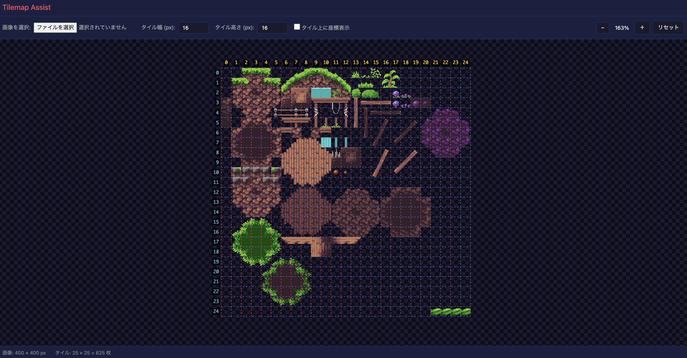

# Tilemap Assist

タイルマップ・スプライトシート用のアシストツール。

itch.io等で取得したタイルマップ素材の座標確認や、UIスプライトシートの領域定義に使用する。



## 機能

### タイルマップビューア

- タイルマップ画像の読み込み（ドラッグ&ドロップ / ファイル選択）
- タイルサイズ指定によるグリッド表示（赤：縦線、青：横線）
- X/Y軸ルーラー表示
- タイルホバー時のツールチップ座標表示
- ズーム / パン操作
- 背景色切り替え（暗/白）

### スプライト定義エディタ

- スプライトシート画像の読み込み
- 矩形ツールでスプライト領域を定義
- スプライト名の編集
- TOML形式でエクスポート/インポート（コメント記述可能）

## 使い方

```bash
npm install
npm run dev
```

ブラウザで http://localhost:5173 を開く。

### タイルマップタブ

| 操作 | 説明 |
|------|------|
| ドラッグ | パン（画像の移動） |
| マウスホイール | ズームイン/アウト |
| タイルにホバー | 座標をツールチップ表示 |

### スプライト定義タブ

| 操作 | 説明 |
|------|------|
| 選択ツール | スプライトをクリックで選択、ドラッグでパン |
| 矩形追加ツール | ドラッグで範囲指定 → スプライト追加 |
| Import TOML | 既存のTOMLを読み込んで作業を再開 |
| Export TOML | 定義をTOMLファイルとしてダウンロード |

### 出力TOML形式

```toml
image = "ui_sheet.png"

# ボタン通常状態
[[sprites]]
name = "button_normal"
x = 0
y = 0
width = 64
height = 32

# ボタンホバー状態
[[sprites]]
name = "button_hover"
x = 64
y = 0
width = 64
height = 32
```

## 開発

```bash
# 開発サーバー起動
npm run dev

# ビルド
npm run build

# プレビュー
npm run preview
```

## 技術スタック

- TypeScript
- Vite
- Canvas API
